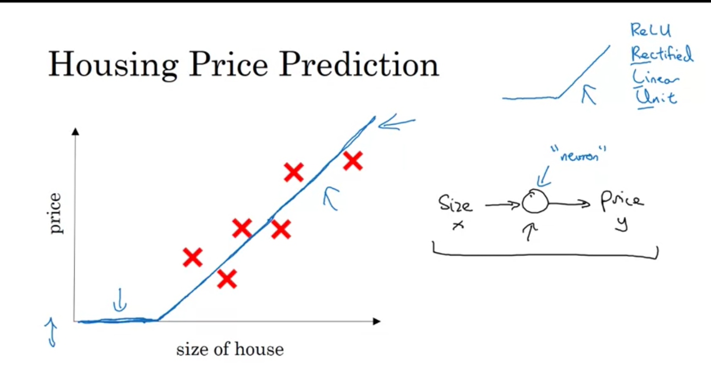
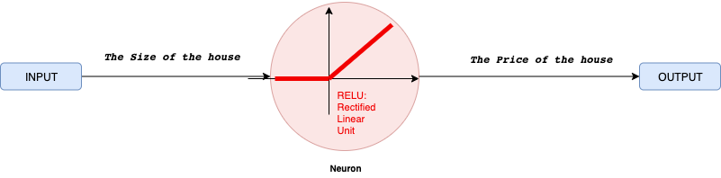
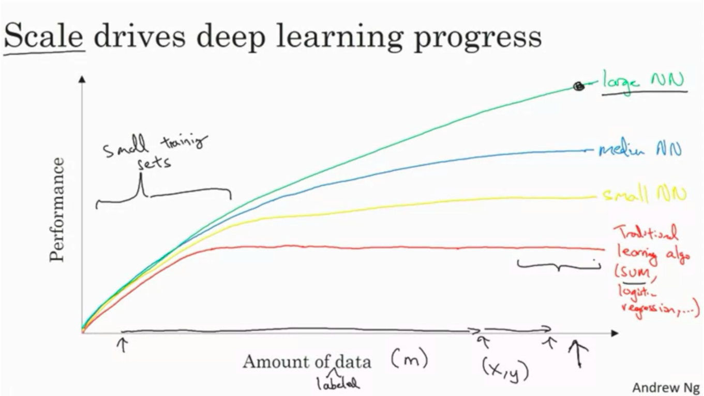

## What is a neural network?

* *Let's start to the Housing Price Prediction example.*
    * Let's say you have a data sets with six houses.
    * You know the size of the houses in square feet or square meters
    * You know the price of the house
    * You want to fit a function to predict the price of the houses, the function of the size. 

* In linear regression 
    * We put a straight line to these data 
    * The prices can never be negative so for this let's bend the curve here. 
    * the blue line ends up being your function for predicting the price of the house as a function of this size. 
    * You can think of this function as a very simple neural network. 
    * It's almost as simple as possible neural network

* Simple neural network
* We have a input to the neural network: the size of a house(we call **x**). 
* **x** goes into this node, this little circle which is a single neuron and then it outputs the price (we call **y)**. 
* A single neuron in a neural network, implements the Relu function.
* The ReLU function which stands for rectified linear units means taking a max of zero (0) which is why you get a function shape like this.

**All the neuron does is takes inputs, computes the linear function, takes a max of zero, and then outputs the estimated value**

 * A larger neural network is then formed by taking many of the single neurons and stacking them together. So, if you think of this neuron that's being like a single Lego brick, you then get a bigger neural network by stacking together many of these Lego bricks.
 
* Instead of predicting the price of a house just from the size, you have also other features.
* Such as 
    * the size of the house 
    * the number of bedrooms, 
    * the zip code or postal code ,which is a future to tells you, walkability
    * the wealth of the neighborhood
* With  given these input features, the job of the neural network will be to predict the price y.

## Supervised Learning with Neural Networks

* n supervised learning, you have some **input x**, and you want to learn a function mapping to some **output y**. In the example of housing price prediction application where the input is some features of a home and try to output or estimate the price y. 

* Different types of neural networks for supervised learning which includes:
    * CNN or convolutional neural networks (Useful in computer vision)
    * RNN or Recurrent neural networks (Useful in Speech recognition or NLP)
    * Standard NN (Useful for Structured data)
    * Hybrid/custom NN or a Collection of NNs types

* **Structured data** is like the databases and tables.
* **Unstructured data** is like images, video, audio, and text.
* Structured data gives more money because companies relies on prediction on its big data.

## Why is Deep Learning taking off?

* Why is deep learning certainly working so well...
* Let's answer this question with marsan question: we plot a figure
    * horizontal axis shows the amount of data we have for a task
    * vertical axis shows the performance on above learning algorithms: *such as*

        * support vector machine or logistic regression as a function of the amount of data: performance improves for a while as you add more data but after a while the performance you know pretty much plateaus 

        * small neural net can perform as Linear regression or SVM (Support vector machine)
        * For big data a small NN is better that SVM
        * For big data a big NN is better that a medium NN is better that small NN.
        * very large neural net:  
            * First:we need to be able to train a big enough neural network in order to take advantage of the huge amount of data

            * Second: we need to improving scale has actually taken us a long way in the world of learning in order to make this diagram a bit more technically precise and just add a few more things 
